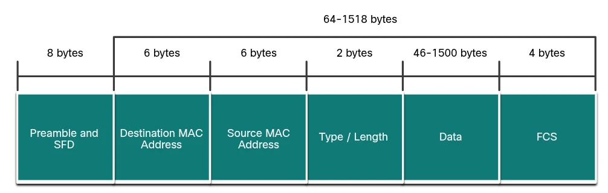

## MODULE OVERVIEW

This module provides a rigorous technical examination of the **Ethernet** and **Internet Protocol (IP)** suites. For a Cybersecurity Analyst, understanding the precise bit-level functions of these protocols is mandatory for interpreting packet captures (PCAP) and identifying anomalous network behavior. The focus is on the structural integrity of frames and the logic governing packet traversal across disparate networks.

---

## CORE CONCEPTS & DEFINITIONS

### The Ethernet Protocol (Layer 2)
Ethernet operates at the Data Link layer (OSI Layer 2) and the Physical layer, providing the physical addressing required for **hop-to-hop** communication. It is defined by the **IEEE 802.2 and 802.3** standards and supports data transfer rates from **10 Mbps to 100,000 Mbps (100 Gbps)**. It uses the **CSMA/CD** (Carrier Sense Multiple Access with Collision Detection) access control method.

* **MAC Address**: A **48-bit** physical address burned into the NIC by the manufacturer. It is globally unique and expressed in **12 hexadecimal digits** (4 bits per hex digit). It can be represented using dashes, colons, or periods.
* **Unicast vs. Broadcast**: A **source** MAC address must always be a **unicast** address (identifying a single NIC). A **destination** address may be unicast, multicast, or broadcast.
* **LLC Sublayer (IEEE 802.2)**: The Logical Link Control sublayer **communicates with upper-layer protocols**. It does NOT add the header/trailer (that is the MAC sublayer's job) and is NOT responsible for media access control.

### The Internet Protocol (Layer 3)
The Network layer provides **end-to-end delivery** services. It encapsulates the **Transport layer (Layer 4) segment** into a packet. The primary protocols, **IPv4** and **IPv6**, share three fundamental characteristics:

* **Connectionless**: No session establishment occurs at this layer before sending packets.
* **Best Effort**: Reliability is not a function of the Network layer; delivery is **not guaranteed**. Packets may be lost, corrupted, or arrive out of order. IP does not retransmit packets.
* **Media Independent**: The protocol operates identically over copper, fiber, or wireless media. However, the network layer is responsible for **fragmentation** when a packet is too large for the medium's MTU.

> **Exam tip:** The Transport layer (Layer 4) sends **segments** to be encapsulated by the Network layer (Layer 3) into IPv4 or IPv6 packets.

---

## TECHNICAL TAXONOMY & CLASSIFICATION

### Ethernet Frame Field Functional Analysis
The minimum Ethernet frame size is **64 bytes** and the maximum is **1518 bytes** (from Destination MAC through FCS — the Preamble is **not** counted in frame size). Frames below the minimum are called **"runt frames"** and are discarded.

| Field | Size | Technical Purpose |
| :--- | :--- | :--- |
| **Preamble** | 7 bytes | **Notifies destinations to get ready** (synchronize) for a new incoming frame. |
| **Start Frame Delimiter (SFD)** | 1 byte | Signals that the next byte is the start of the Destination MAC address. |
| **Destination Address** | 6 bytes | The critical field used by a host to **determine if a frame is addressed to it**. Compared against the device's own MAC address. Can be unicast, multicast, or broadcast. |
| **Source Address** | 6 bytes | Identifies the originating NIC. A source MAC address can **only be a unicast** address. |
| **Type / Length (EtherType)** | 2 bytes | **Identifies the encapsulated higher-layer protocol** (e.g., 0x0800 = IPv4, 0x86DD = IPv6, 0x0806 = ARP). |
| **Data Field** | 46–1500 bytes | Contains the Layer 3 PDU (packet). If the payload is too small, **padding bits** are added to meet the 64-byte minimum. |
| **Frame Check Sequence (FCS)** | 4 bytes | Used by the destination to **detect transmission errors** via a CRC (Cyclic Redundancy Check). If the recalculated CRC does not match, the frame is **dropped**. |

> **Exam tip — Preamble vs. FCS:**
> * **Preamble** → "get ready to receive"
> * **FCS** → "check for errors after receiving"

### IPv4 Packet Header — Key Fields

| Field | Technical Purpose |
| :--- | :--- |
| **Version** | Identifies the IP version (0100 = IPv4). |
| **Differentiated Services (DS / DSCP)** | Used to determine the **priority** of each packet (QoS). |
| **Time to Live (TTL)** | Decremented by 1 at each router hop. When it reaches 0, the packet is **discarded** and an ICMP "Time Exceeded" message is sent. Prevents infinite routing loops. |
| **Protocol** | Identifies the next-level (Layer 4) protocol encapsulated in the packet. Common values: **ICMP = 1, TCP = 6, UDP = 17**. |
| **Header Checksum** | Used to **detect corruption in the IPv4 header** only (not the data payload). |
| **Source IP Address** | 32-bit address of the originating host. **Does not change** in transit (except with NAT). |
| **Destination IP Address** | 32-bit address of the destination host. **Does not change** in transit (except with NAT). |
| **Identification, Flags, Fragment Offset** | Used to **track and reassemble fragmented packets**. |



> **Exam tip — Header Checksum vs. FCS:**
> * **Header Checksum** → detects corruption in the **IPv4 header** (Layer 3)
> * **FCS** → detects errors in the **Ethernet frame** (Layer 2)

> **Common trap:** The **Total Length** and **Header Checksum** fields are used to **identify and validate** the packet. The fields used to **reorder fragmented packets** are **Identification, Flags, and Fragment Offset** — NOT Total Length or Header Checksum.

### IPv4 vs. IPv6 Header Comparison

| Feature | IPv4 | IPv6 |
| :--- | :--- | :--- |
| **Address Length** | 32-bit | 128-bit |
| **Address Representation** | Dotted Decimal | Hexadecimal (hextets) |
| **Error Handling** | Header Checksum present | **No Header Checksum** (handled at Layer 2/4) |
| **Configuration** | Static or DHCPv4 | SLAAC or DHCPv6 |
| **Fragmentation** | Performed by routers **or** source | Performed **only by source** |
| **Address Space** | ~4.3 billion | ~340 undecillion |

---

## OPERATIONAL ANALYSIS

### IPv4 Addressing: Network vs. Host Portion
An IPv4 address is a **32-bit hierarchical address** that contains:
* A **network portion** (identifies the network)
* A **host portion** (identifies the specific host on that network)

The **subnet mask** differentiates the two portions. A subnet mask is a **consecutive sequence of 1 bits** (determining the network portion) followed by a **consecutive sequence of 0 bits** (determining the host portion). It is **NOT** any arbitrary combination of 0s and 1s. It is **32 bits** in length (same as IPv4), **not** 24 bits.

> **The 1 bits in the subnet mask → network portion. The 0 bits → host portion.**

The IPv4 address alone is **insufficient** to determine the network and host portions — the subnet mask is always required.

### The ANDing Process
To determine the destination of a packet, a Layer 3 device performs a bitwise **AND** operation.

**AND truth table:**
* 1 AND 1 = **1**
* 1 AND 0 = **0**
* 0 AND 1 = **0**
* 0 AND 0 = **0**

> **Exam tip — AND rules:**
> * 1 AND 0 = **0** ✓
> * 1 AND 1 = **1** ✓ (NOT 0)
> * The AND is performed between an **IPv4 address** and a **subnet mask** (NOT between two IPv4 addresses).
> * **Purpose**: to identify the **network address** of the destination (NOT the host address, NOT the broadcast address).

**Example:** `10.128.17.4 AND 255.255.240.0`

```
10.128.17.4   = 00001010.10000000.00010001.00000100
255.255.240.0 = 11111111.11111111.11110000.00000000
                -----------------------------------------
Result        = 00001010.10000000.00010000.00000000
              = 10.128.16.0
```
**→ Network address: 10.128.16.0 / 255.255.240.0**

### Subnet Capacity Calculation
For the CyberOps exam, precise host calculations are required.

**Formula:** Usable hosts = $2^n - 2$ (subtract network address and broadcast address), where *n* = number of **host bits**.

**Example: 192.168.1.0/27**
* /27 → 27 bits for network, **5 bits for hosts**
* $2^5 = 32$ total addresses
* **30 usable host addresses**

### Host Forwarding Decisions
A source host determines whether a destination is **local or remote** by ANDing its own subnet mask with both its own IP address and the destination IP address, then comparing the results.

* **Local destination** → host communicates directly (no router needed). Local hosts can reach each other without a router.
* **Remote destination** → packet sent to the **default gateway**.

**The default gateway:**
* Is the IP address of the **router** on the **local** network (not a switch, not a remote network device).
* Has an IP address in the **same range** as the local hosts.
* Is required to forward packets **outside** the local network. Without a default gateway, traffic cannot leave the local network.
* Is **not** needed for communication between hosts on the **same** local network.

### Host Routing Table
A host maintains its own **local routing table** containing:
1. A route to the **loopback interface**
2. A **local network route**
3. A **remote default route** (via the default gateway)

**Commands:**
* `netstat -r` or `route print` → displays the **host routing table**

### ANDing Process — Purpose at Layer 3
A Layer 3 device performs the ANDing process on a **destination IP address and subnet mask** to identify the **network address** of the destination network. This is used to make routing decisions (local vs. remote, which route to use).

---

## CASE STUDIES & EXAM SPECIFICS

### Fragmentation and MTU
When a router receives a packet that is larger than the **Maximum Transmission Unit (MTU)** of the exit interface, it must perform **Fragmentation**. The router breaks the packet into smaller pieces. The destination host reassembles the fragments using the **Identification, Flags, and Fragment Offset** fields in the IPv4 header.

> **Key vocabulary:**
> * **Segmentation** → Transport layer (TCP breaks data into segments)
> * **Fragmentation** → Network layer (router/source splits packets for a smaller MTU)
> * **Encapsulation** → wrapping data with protocol headers
> * **Serialization** → converting data to a bitstream for transmission

### Loopback Verification
To verify that the internal TCP/IP protocol stack is functioning correctly **without** sending traffic onto the physical media:
* **IPv4 loopback**: `127.0.0.1`
* **IPv6 loopback**: `::1`
* **Command**: `ping 127.0.0.1`
* **Tests**: The TCP/IP stack on the local network host — **not** physical connectivity, **not** connectivity to another device.

### Private IPv4 Address Ranges
These three address blocks are reserved for private use and are **not routable** on the public internet:

| Range | CIDR | Class |
| :--- | :--- | :--- |
| **10.0.0.0 – 10.255.255.255** | 10.0.0.0/8 | Class A |
| **172.16.0.0 – 172.31.255.255** | 172.16.0.0/12 | Class B |
| **192.168.0.0 – 192.168.255.255** | 192.168.0.0/16 | Class C |

> **Exam tip:** `172.16.4.4` ✓ private | `172.32.x.x` ✗ NOT private | `192.167.x.x` ✗ NOT private | `224.x.x.x` → multicast (NOT private)

### IP Characteristics (Two key ones for exam)
IP **does**:
* Operate **without a dedicated end-to-end connection** (connectionless)
* Operate **independently of the network media** (media independent)

IP does **NOT**:
* Guarantee delivery of packets
* Re-assemble out-of-order packets at the receiver *(that is TCP's job at Layer 4)*
* Retransmit packets if errors occur

### IPv6 Address Compression and Identification
IPv6 utilizes a /64 prefix for most LANs, splitting the address into:
1. **Prefix (First 64 bits)**: Network identification.
2. **Interface ID (Last 64 bits)**: The host identifier.

**Two compression rules:**
1. **Omit leading zeros** in any hextet: `0db8` → `db8`, `0000` → `0`
2. **Double colon (::)** replaces one contiguous string of all-zero hextets. Can only be used **once** per address.

**Example:** `2001:0DB8:75a3:0214:0607:1234:aa10:ba01 /64`
* Network prefix: `2001:0DB8:75a3:0214`
* Host identifier: **`0607:1234:aa10:ba01`**

**Compressed IPv6 example:** `2001:0db8:eeff:000a:0000:0000:0000:0001`
* Omit leading zeros: `2001:db8:eeff:a:0:0:0:1`
* Apply double colon: **`2001:db8:eeff:a::1`**

### MAC Address Key Facts
* It is a **physical address** assigned to an Ethernet NIC **by the manufacturer**.
* It is **48 bits** in length (expressed as 12 hex digits).
* It identifies **local** (Layer 2) source and destination — NOT internet-wide addresses (that is IPv4/IPv6).
* It contains **no** network portion / host portion split (that is an IP address concept).

### Ethernet Technology — Key Characteristics (Choose two on exam)
* Supported by **IEEE 802.3** standards ✓
* Uses **CSMA/CD** access control method ✓
* Uses a **bus or star** topology (NOT ring — ring is Token Ring / IEEE 802.5)
* Supports speeds from **10 Mbps to 100 Gbps** (NOT an "average of 16 Mbps")

### OSI Network Layer Services (Choose two on exam)
The Network layer (Layer 3) provides:
* **Routing** — selecting the best path to a destination
* **Logical addressing** — IP addressing of end devices

The Network layer does **NOT** provide:
* Error detection (→ Layer 2 FCS, or Layer 4 TCP)
* Placement of frames on media (→ Layer 2)
* Collision detection (→ Layer 1/2 CSMA/CD)