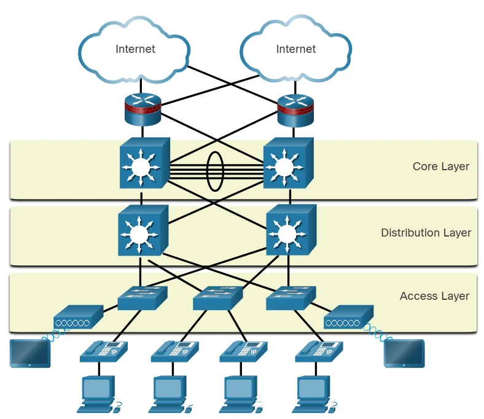

## MODULE OVERVIEW

Network security infrastructure defines the interconnection of devices to facilitate secure end-to-end communications. The primary objective is to protect data resources and ensure service availability through standardized designs recommended by the network industry. This module examines the three-layer network design model, various firewall architectures (including **Zone-Based Policy Firewalls**), and the operational implementation of **Access Control Lists (ACLs)** and management protocols such as **SNMP**, **NetFlow**, and **AAA**.

---

## CORE CONCEPTS & DEFINITIONS

| Term | Definition |
| :--- | :--- |
| **Access Control List (ACL)** | A sequential series of commands that permit or deny packets based on information within the packet header, such as source or destination addresses. |
| **Zone-Based Policy Firewall (ZPF)** | A security model where interfaces are assigned to logical zones, and security policies are applied to traffic moving between these zones. |
| **Simple Network Management Protocol (SNMP)** | An application layer protocol that enables administrators to monitor and manage performance, solve problems, and plan for growth across network devices. |
| **Authentication, Authorization, and Accounting (AAA)** | A framework for controlling access to network resources, enforcing policies, and auditing usage. |
| **Virtual Private Network (VPN)** | A private, encrypted communication environment created over a public network infrastructure to ensure data confidentiality. |
| **NetFlow** | A Cisco protocol that provides detailed statistics on IP packet flows passing through a networking device. |
| **Port Mirroring** | A switch feature that duplicates traffic from one port and forwards it to another port where a network monitor or packet analyzer is attached. |
| **Syslog** | A standard protocol for forwarding log messages from network devices to a central logging server. |
| **NTP (Network Time Protocol)** | Synchronizes the clocks of network devices to ensure consistent and accurate timestamps across the infrastructure. |

---

## TECHNICAL TAXONOMY & CLASSIFICATION

### Hierarchical Network Design Layers

The campus wired LAN uses a hierarchical design model to separate the network topology into modular groups or layers. Separating the design into layers allows each layer to implement specific functions, which simplifies network design, deployment, and management.

| Layer | Primary Function | Key Characteristics |
| :--- | :--- | :--- |
| **Access Layer** | Provides endpoints and users with initial connectivity to the network | Switches, wireless APs; first point of entry for devices |
| **Distribution Layer** | Aggregates traffic from the access layer and provides connectivity to services | Routing, filtering, QoS policies, VLAN boundaries |
| **Core Layer** | Provides high-speed connectivity between distribution layers in large LAN environments | High-speed switching fabric; minimal processing, maximum throughput |



> **Design principle:** Each layer has a distinct role. Adding features at the wrong layer (e.g., heavy ACL filtering at the Core) undermines performance and manageability.

---

### Firewall Technology Classification

Firewalls are the only transit points between internal corporate networks and external networks, enforcing access control policies between trusted and untrusted zones.

#### Benefits and Limitations of Firewalls

| Benefits | Limitations |
| :--- | :--- |
| Prevent exposure of sensitive hosts to untrusted users | Misconfiguration can create a single point of failure |
| Sanitize protocol flows, blocking protocol exploitation | Some application data cannot be passed securely |
| Block malicious data from servers and clients | Users may tunnel unauthorized traffic through the firewall |
| Centralize and simplify security management | Can slow network performance under heavy load |
| Resistant to network attacks | Cannot protect against threats that bypass the firewall entirely |

#### Firewall Types — Comparison Table

| Firewall Type | OSI Layer(s) | Key Mechanism | Typical Use Case |
| :--- | :--- | :--- | :--- |
| **Packet Filtering** | L3, L4 | Stateless policy table look-up on IP and port information | Basic router ACL enforcement (e.g., block port 25) |
| **Stateful** | L3, L4, L5 | Tracks active connections in a state table; most common type | Enterprise perimeter defense |
| **Application Gateway (Proxy)** | L3, L4, L5, L7 | Proxies connections; client never reaches server directly | Deep inspection of HTTP, FTP, DNS traffic |
| **Next-Generation (NGFW)** | L3 – L7 | Integrates IPS, application awareness, threat intelligence | Modern enterprise and cloud-edge security |
| **Transparent** | L2 | Filters IP traffic between a pair of bridged interfaces | Inline inspection without IP re-addressing |
| **Host-Based** | Application | Firewall software running on a specific PC or server | Endpoint protection for servers and workstations |
| **Hybrid** | Multiple | Combines features of multiple firewall types (e.g., stateful + proxy) | Complex environments requiring layered inspection |

---

## OPERATIONAL ANALYSIS

### Firewall Design Architectures

#### 1. Private / Public (Two-Interface Design)

The simplest firewall design uses two interfaces: one inside (trusted) and one outside (untrusted).

- Traffic from the **private network** toward the public network is inspected and permitted.
- Return traffic associated with sessions initiated from the inside is permitted.
- Traffic **originating from the public network** toward the private network is generally blocked.

#### 2. Demilitarized Zone (DMZ) — Three-Interface Design

A DMZ adds a third interface to host publicly accessible services (web servers, mail, DNS) while protecting the internal network.

| Traffic Direction | Behaviour |
| :--- | :--- |
| Inside → Outside / DMZ | Inspected and permitted with minimal restriction |
| Outside → DMZ | Selectively permitted for specific services (HTTP, HTTPS, DNS, SMTP) |
| DMZ → Inside | Blocked to protect the private network |
| Outside → Inside | Strictly blocked |
| DMZ → Outside | Selectively permitted based on service requirements |

#### 3. Zone-Based Policy Firewall (ZPF)

ZPF is the evolution of stateful inspection on Cisco IOS routers. Instead of applying policies per-interface, ZPF groups interfaces into **logical zones** based on trust level or function.

**Key ZPF Principles:**

| Principle | Description |
| :--- | :--- |
| **Zone Grouping** | Interfaces with similar functions are grouped (e.g., INSIDE, OUTSIDE, DMZ). One interface can only belong to one zone. |
| **Default Intra-Zone Policy** | Traffic between interfaces in the **same zone** passes freely with no policy applied. |
| **Default Inter-Zone Policy** | All traffic between **different zones** is blocked by default. |
| **Zone-Pair** | A unidirectional configuration (e.g., INSIDE → OUTSIDE) required to permit cross-zone traffic. |
| **Self Zone** | Represents the router itself (all interface IPs). By default, no policy is applied to traffic sourced from or destined to the router. Relevant for SSH, SNMP, and routing protocols. |

---

### Access Control List (ACL) — Implementation and Verification

ACLs increase network performance by limiting unnecessary traffic and provide a basic security layer by filtering packets at the router.

#### ACL Types

| ACL Type | Filter Criteria | Recommended Placement |
| :--- | :--- | :--- |
| **Standard ACL** (1–99, 1300–1999) | Source IPv4 address only | As close to the **destination** as possible |
| **Extended ACL** (100–199, 2000–2699) | Protocol, source/destination IP and port | As close to the **source** as possible |
| **Named ACL** | Same as standard/extended, identified by name | Flexible; replaces numbered ACLs in modern configs |

#### ACL Functional Roles

- **Traffic limitation:** Block video or streaming traffic to reduce bandwidth consumption.
- **Traffic flow control:** Restrict routing update delivery to known sources only.
- **Basic access security:** Allow or deny specific hosts from accessing network segments.
- **Traffic type filtering:** Permit email while blocking Telnet.

#### Lab Reference — ACL Demonstration (Packet Tracer 12.3.4)

This lab illustrates the effect of a Standard ACL on ICMP (ping) traffic:

**Scenario:** ACL 11 is applied **outbound** on interface `Serial0/0/0` of router R1.

```
R1# show access-lists
Standard IP access list 11
  10 deny   192.168.10.0 0.0.0.255
  20 permit any
```

| Statement | Effect |
| :--- | :--- |
| `10 deny 192.168.10.0 0.0.0.255` | Blocks all traffic from the 192.168.10.0/24 subnet (including ICMP pings) |
| `20 permit any` | Permits all other traffic |

**Result:** PC1 (on 192.168.10.0/24) can ping local devices (PC2, PC3) but **cannot ping** remote devices (PC4, DNS Server) because the ACL blocks its traffic before it exits `Se0/0/0`.

**ACL Removal Procedure:**

```bash
R1(config)# int se0/0/0
R1(config-if)# no ip access-group 11 out   ! Detach ACL from interface
R1(config)# no access-list 11              ! Remove ACL from global config
```

#### Key Verification Commands

| Command | Purpose |
| :--- | :--- |
| `show access-lists` | Display all configured ACLs and hit counters |
| `show access-lists [number/name]` | Display a specific ACL |
| `show ip interface [interface]` | Show which ACL is applied and in which direction |
| `show run` | View full running configuration including ACL bindings |
| `no access-list [number]` | Remove a specific ACL from global configuration |
| `no ip access-group [number] [in/out]` | Detach an ACL from an interface |

> **Important:** An ACL has **no effect** until it is applied to an interface in a specific direction (`in` or `out`). Inbound ACLs are evaluated before routing; outbound ACLs are evaluated after routing.

---

### Network Monitoring and Management Protocols

| Protocol / Tool | Function | Key Detail |
| :--- | :--- | :--- |
| **SNMP** | Allows administrators to monitor and manage network devices | Collects performance data; sends traps on threshold events |
| **NetFlow** | Provides statistics on packet flows through a device | Identifies flows by 7 fields: src/dst IP, src/dst port, L3 protocol, ToS, input interface |
| **Port Mirroring (SPAN)** | Duplicates traffic from one switch port to another for analysis | Used to connect packet analyzers or IDS/IPS without disrupting traffic |
| **Syslog** | Forwards system messages to a centralized syslog server | Severity levels 0 (Emergency) to 7 (Debug); critical for forensic analysis |
| **NTP** | Synchronizes time across all network devices | Essential for consistent log timestamps and security forensics |

---

## CASE STUDIES & EXAM SPECIFICS

### DMZ Traffic Flow — Decision Matrix

```
[Internet/Outside]
       |
   [ Firewall ]
   /     |     \
Outside  DMZ  Inside
         |
  [Web Server / Mail / DNS]
```

| Source Zone | Destination Zone | Default Action |
| :--- | :--- | :--- |
| Inside | Outside | ✅ Permitted & inspected |
| Inside | DMZ | ✅ Permitted & inspected |
| Outside | DMZ | ⚠️ Selectively permitted (HTTP, HTTPS, DNS, SMTP only) |
| DMZ | Inside | ❌ Blocked |
| Outside | Inside | ❌ Blocked |
| DMZ | Outside | ⚠️ Selectively permitted |

---

### Zone-Based Policy Firewall (ZPF) — Exam Logic Summary

| Scenario | Traffic Behaviour |
| :--- | :--- |
| LAN1 (zone A) → LAN2 (zone A) | ✅ Free passage — same zone |
| LAN1 (zone A) → WAN (zone B) | ❌ Blocked by default — requires zone-pair + policy |
| SSH to router interface IP | Uses **self-zone** policy; unrestricted by default |
| Two interfaces, no zone assigned | Operate as classical IOS interfaces (no ZPF rules apply) |

---

### AAA Security Framework

| AAA Function | Description | Example |
| :--- | :--- | :--- |
| **Authentication** | Verifies identity via credentials, tokens, or challenge/response | Username + password login |
| **Authorization** | Defines what an authenticated user is allowed to do | "User 'student' can SSH to serverXYZ only" |
| **Accounting** | Records actions taken by authenticated users | "User 'student' accessed serverXYZ via SSH for 15 minutes" |

#### TACACS+ vs RADIUS — Comparison

| Feature | TACACS+ | RADIUS |
| :--- | :--- | :--- |
| **Transport Protocol** | TCP | UDP |
| **Encryption Scope** | Entire packet encrypted | Password only |
| **AAA Separation** | Fully separated (modular) | Authentication + Authorization combined |
| **Standard** | Mostly Cisco proprietary | Open / RFC standard |
| **Protocol Challenge** | Bidirectional (CHAP-based) | Unidirectional |
| **Router Command Auth.** | Per-user / per-group | Not supported |
| **Accounting** | Limited | Extensive |
| **Best For** | Network device administration | Network access (users/VPN) |

---

### NTP Stratum Levels

```
Stratum 0  — Atomic clocks / GPS (hardware reference)
    |
Stratum 1  — Servers directly attached to Stratum 0
    |
Stratum 2  — NTP clients / servers synced to Stratum 1
    |
Stratum 3+ — Devices synced to Stratum 2 (up to max 15 hops)
    |
Stratum 16 — Unsynchronized device
```

| Stratum Level | Description |
| :--- | :--- |
| **0** | High-precision hardware devices (atomic clocks, GPS) — not directly on the network |
| **1** | Directly connected to a Stratum 0 source |
| **2** | Synchronized via network to Stratum 1 servers; can also serve Stratum 3 |
| **16** | Device is unsynchronized — indicates an NTP failure |

> **Note:** Smaller stratum numbers indicate proximity to the authoritative time source. The maximum hop count is 15.

---

### VPN — Virtual Private Networks

A VPN creates a logical private connection over a public network, providing confidentiality through encryption.

| VPN Layer | Protocols / Technologies |
| :--- | :--- |
| **Layer 2** | L2TP, PPTP |
| **Layer 3** | GRE, IPsec, MPLS |

- **GRE (Generic Routing Encapsulation):** Encapsulates various Layer 3 protocols inside IP tunnels. Does not provide encryption natively.
- **IPsec:** A suite of IETF protocols providing authentication, integrity, and encryption for IP traffic. The most common secure VPN solution.
- **MPLS:** Provides any-to-any site connectivity across service provider networks.

---

## REVIEW QUESTIONS — QUICK REFERENCE

| Question | Answer |
| :--- | :--- |
| Which layer provides endpoint/user connectivity? | **Access Layer** |
| Which layer provides inter-distribution connectivity in large LANs? | **Core Layer** |
| Which layer aggregates traffic and connects to services? | **Distribution Layer** |
| Which design groups interfaces with similar functions into zones? | **ZPF (Zone-Based Policy Firewall)** |
| Which firewall filters at L3, L4, L5, L7? | **Application Gateway (Proxy)** |
| Which firewall is a combination of multiple types? | **Hybrid** |
| Which firewall is part of a router, filtering on L3/L4? | **Packet Filtering** |
| Which firewall runs as software on a PC or server? | **Host-Based** |
| Which firewall filters between a pair of bridged interfaces? | **Transparent** |
| What makes duplicate copies of switch traffic for monitoring? | **Port Mirroring** |
| What is a series of commands controlling packet forwarding/dropping? | **ACL** |
| What provides statistics on packet flows through a device? | **NetFlow** |
| What creates a private network over a public network? | **VPN** |
| What sets date and time on network devices? | **NTP** |
| What gathers status messages from devices to a server? | **Syslog** |
| What allows administrators to monitor and manage network devices? | **SNMP** |
| What authenticates users, controls resource access, and logs activity? | **AAA Server** |

---

## CRITICAL THINKING — EXAM QUESTION

> **How does the implementation of a stateful firewall differ operationally from a packet-filtering firewall when handling returning traffic from an untrusted network?**

A **packet-filtering firewall** is stateless — it evaluates each packet independently against a static rule table based on L3/L4 headers (IP address, port, protocol). It has no memory of previous packets. For returning traffic from an external server to be permitted, the administrator must explicitly create a rule allowing inbound traffic on the relevant port — which can inadvertently open the network to unsolicited inbound connections.

A **stateful firewall** maintains a **connection state table**. When a host on the trusted network initiates a connection outbound, the firewall records this session (source IP, destination IP, ports, sequence numbers, state). When the return traffic arrives from the untrusted network, the firewall checks the state table and recognizes it as belonging to an established, legitimate session — and permits it automatically. No static inbound rule is required. Traffic that does not match any existing state entry is dropped, making stateful firewalls significantly more secure for handling asymmetric return traffic.