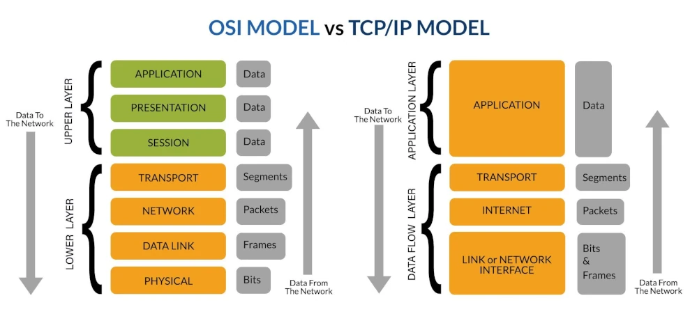
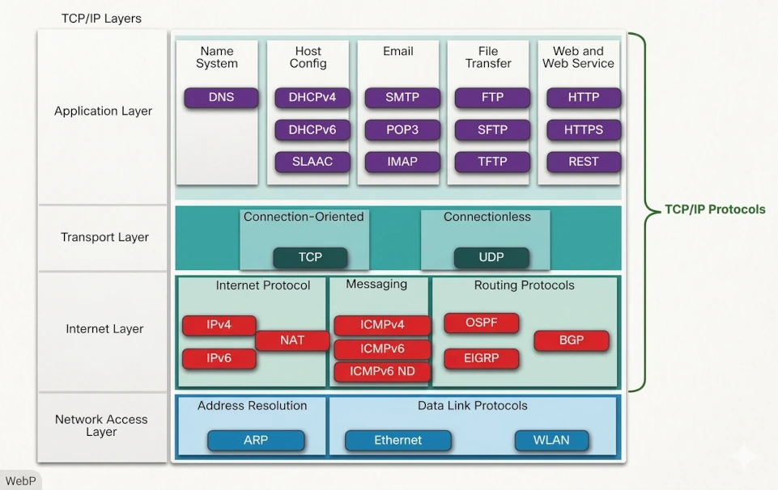

## VUE D'ENSEMBLE DU MODULE

Les communications réseau sont régies par des ensembles de règles standardisés appelés **protocoles**. Ces protocoles définissent les exigences concernant l'encodage, le formatage, l'encapsulation, la taille, la synchronisation et la livraison des messages. Pour un analyste en Opérations de Cybersécurité (CyberOps), la compréhension de ces protocoles est fondamentale pour l'analyse du trafic, la détection d'anomalies et la détermination de l'origine et de la destination du trafic réseau. La communication suit souvent un modèle **client-serveur**, où les clients, tels que les navigateurs web, demandent des services à des logiciels serveurs spécialisés, tels que les serveurs HTTP.

### Pourquoi C'est Essentiel en CyberOps

En tant qu'analyste en cybersécurité, vous devez être capable de déterminer l'origine du trafic entrant dans le réseau et la destination du trafic qui en sort. Comprendre le chemin emprunté par le trafic réseau — y compris quels protocoles sont utilisés à chaque couche — est indispensable pour la détection des menaces et la réponse aux incidents. Tout comme un mécanicien automobile doit comprendre le moteur, un analyste CyberOps doit avoir une connaissance approfondie du fonctionnement des réseaux au niveau des protocoles.

---

## CONCEPTS FONDAMENTAUX & DÉFINITIONS

### Des Réseaux de Toutes Tailles

Les réseaux vont de simples configurations à deux équipements jusqu'à des infrastructures mondiales connectant des millions de points d'accès :

* **Réseaux Domestiques :** Partagent des ressources (imprimantes, fichiers, médias) entre un petit nombre d'équipements locaux.
* **Petit Bureau / Bureau à Domicile (SOHO) :** Permettent aux télétravailleurs de se connecter aux ressources d'entreprise ou à des services centralisés.
* **Réseaux d'Entreprise :** Fournissent le stockage, la messagerie, la communication instantanée et l'accès aux applications à un grand nombre d'utilisateurs.
* **Internet :** Le plus grand réseau existant — un « réseau de réseaux » composé de réseaux privés et publics interconnectés. Le trafic transite par des FAI de **Niveau 1** et **Niveau 2** connectés via des **Points d'Échange Internet (IXP)**. Les grandes organisations se connectent via un **Point de Présence (PoP)**. Les **FAI de Niveau 3** assurent la connexion du dernier kilomètre vers les foyers et les entreprises.

> **Note :** Le trafic entre un client et un serveur peut emprunter de nombreux chemins différents, et le chemin retour peut être entièrement différent du chemin aller. Ce routage asymétrique est une considération clé pour l'analyse du trafic.

### Communications Client-Serveur

Tous les équipements connectés à un réseau qui participent directement aux communications sont appelés **hôtes**, **équipements terminaux**, **points d'accès** ou **nœuds**. La plupart des interactions suivent le **modèle client-serveur** :

* Les **Clients** utilisent des logiciels (navigateurs web, clients de messagerie, applications de transfert de fichiers) pour demander des données aux serveurs.
* Les **Serveurs** utilisent des logiciels spécialisés pour répondre à ces requêtes. Un serveur peut être dédié à une seule fonction (ex. un serveur web) ou polyvalent (ex. gérer simultanément le web, la messagerie et le transfert de fichiers).

Les types de serveurs courants sont :

| Type de Serveur | Fonction |
| :--- | :--- |
| **Serveur de Fichiers** | Stocke les fichiers d'entreprise et utilisateurs dans un emplacement centralisé |
| **Serveur Web** | Exécute des logiciels HTTP/HTTPS pour servir des pages web aux clients |
| **Serveur de Messagerie** | Exécute des logiciels SMTP/POP3/IMAP pour envoyer et recevoir des e-mails |

Dans les **réseaux pair-à-pair**, les hôtes fonctionnent simultanément comme clients et serveurs — courant dans les environnements domestiques.

---

## PROTOCOLES DE COMMUNICATION

### Qu'est-ce qu'un Protocole ?

Le simple fait de disposer d'une connexion physique ou sans fil entre des équipements ne suffit pas à établir une communication. Les équipements doivent s'accorder sur la **manière** de communiquer. Ces règles convenues sont appelées **protocoles**.

Les protocoles réseau spécifient :

* **L'Encodage des Messages** — le processus de conversion de l'information dans la forme appropriée pour la transmission (ex. signaux électriques, impulsions lumineuses, ondes radio). L'hôte récepteur décode les signaux en données exploitables.
* **Le Formatage et l'Encapsulation des Messages** — la structure et le conditionnement des données lors de leur transit dans la pile de protocoles.
* **La Taille des Messages** — les contraintes sur la taille maximale d'une unité transmise.
* **La Synchronisation des Messages** — les règles régissant la vitesse de transmission et la synchronisation (voir ci-dessous).
* **Les Options de Livraison** — unicast, multicast ou broadcast.

### Options de Livraison

| Méthode | Description |
| :--- | :--- |
| **Unicast** | Envoyé à un seul hôte de destination spécifique |
| **Multicast** | Envoyé à un groupe défini d'hôtes |
| **Broadcast** | Envoyé à **tous les hôtes du même réseau** |

> **Focus Examen :** Un broadcast n'est **pas** envoyé à tous les hôtes d'internet — il est limité au **réseau local**.

### Synchronisation et Livraison des Messages

L'efficacité opérationnelle repose sur trois mécanismes de synchronisation principaux :

* **Contrôle de Flux :** Le processus de gestion du débit de transmission des données pour éviter qu'une source ne sature une destination. Les équipements source et destination négocient et gèrent le flux d'informations à l'aide de protocoles réseau.
* **Délai d'Attente de Réponse :** Spécifie la durée pendant laquelle un hôte attend un accusé de réception avant d'entreprendre des actions de récupération, comme la retransmission de la requête.
* **Méthode d'Accès :** Détermine à quel moment un équipement est autorisé à émettre sur le support partagé afin d'éviter les collisions. Par exemple, une carte réseau WLAN doit vérifier que le support sans fil est disponible avant de transmettre.

---

## SEGMENTATION ET MULTIPLEXAGE DES DONNÉES

Les flux de données volumineux ne peuvent pas être transmis en un seul bloc massif. Tout envoyer d'un coup monopoliserait le réseau, et une seule défaillance nécessiterait de retransmettre l'intégralité de la transmission.

* **Segmentation :** Le processus de division d'un flux de données volumineux en fragments plus petits avant la transmission. Requis par la suite de protocoles TCP/IP.
* **Multiplexage :** Le processus d'entrelacement de plusieurs conversations de données fragmentées sur le même support réseau simultanément. Cela augmente le débit global du réseau.
* **Séquençage :** Étant donné que les segments peuvent arriver dans le désordre (ils peuvent emprunter des chemins différents à travers le réseau), **TCP** ajoute des numéros de séquence à chaque segment afin que l'hôte récepteur puisse réassembler les données dans le bon ordre.

> **Avantage d'efficacité de la segmentation :** Si un segment est perdu ou corrompu, seul ce segment doit être retransmis — pas l'intégralité du flux de données d'origine.

---

## TAXONOMIE TECHNIQUE & CLASSIFICATION

### Avantages d'un Modèle en Couches

Les modèles en couches modularisent les opérations réseau et offrent plusieurs avantages clés :

* **Conception des protocoles :** Chaque couche possède une interface définie et agit sur des informations spécifiques, permettant un développement indépendant.
* **Interopérabilité :** Les produits de différents fabricants peuvent communiquer car ils se conforment aux mêmes standards de couche.
* **Isolation des changements :** Une évolution technologique ou fonctionnelle à une couche n'affecte pas les couches situées au-dessus ou en dessous.
* **Langage commun :** Un vocabulaire partagé pour décrire les fonctions et capacités réseau.

Deux modèles principaux sont utilisés :

* **Modèle de Référence OSI** — 7 couches, utilisé principalement comme référence conceptuelle.
* **Modèle de Protocole TCP/IP** — 4 couches, reflète la structure réelle de la suite de protocoles TCP/IP utilisée sur internet.

### Comparaison des Modèles en Couches

Le **Modèle de Référence OSI** et le **Modèle de Protocole TCP/IP** fournissent un cadre permettant de modulariser les opérations réseau en couches gérables.

| Couche OSI | Nom OSI | Couche TCP/IP | PDU | Fonction Technique |
| :--- | :--- | :--- | :--- | :--- |
| 7 | **Application** | **Application** | Données | Communication de processus à processus |
| 6 | **Présentation** | **Application** | Données | Représentation des données et chiffrement |
| 5 | **Session** | **Application** | Données | Gestion des sessions et contrôle des dialogues de communication |
| 4 | **Transport** | **Transport** | **Segment** | Fiabilité de bout en bout, contrôle de flux et adressage par port |
| 3 | **Réseau** | **Internet** | **Paquet** | Détermination du chemin (Routage) et adressage logique (IP) |
| 2 | **Liaison de Données** | **Accès Réseau** | **Trame** | Accès au support et adressage physique (MAC) |
| 1 | **Physique** | **Accès Réseau** | Bits | Transmission des bits sur le support physique |

> **Focus Examen :** La couche **Transport TCP/IP** et la **couche OSI 4** fournissent des services et fonctions similaires. La couche **Application OSI** (couche 7) et la couche **Application TCP/IP** fournissent des fonctions de haut niveau identiques. La couche **Internet TCP/IP** correspond à la **couche OSI 3 (Réseau)** — et non aux trois premières couches OSI.

---

## DÉCOMPOSITION DE LA SUITE DE PROTOCOLES

La **suite de protocoles TCP/IP** est la norme pour internet et les réseaux de données modernes. C'est une famille de protocoles open-source approuvés par l'industrie du réseau.

### Protocoles de la Couche Application

| Catégorie | Protocole | Description |
| :--- | :--- | :--- |
| **Système de Noms** | DNS | Traduit les noms de domaine (ex. cisco.com) en adresses IP |
| **Config. des Hôtes** | DHCPv4 / DHCPv6 | Attribue dynamiquement une configuration IP aux clients au démarrage |
| **Config. des Hôtes** | SLAAC | Permet à un équipement d'obtenir une configuration IPv6 sans serveur DHCP |
| **Messagerie** | SMTP | Permet aux clients d'envoyer des e-mails vers un serveur ; permet l'envoi entre serveurs |
| **Messagerie** | POP3 | Permet aux clients de récupérer et télécharger des e-mails depuis un serveur |
| **Messagerie** | IMAP | Permet aux clients d'accéder et de gérer des e-mails stockés sur un serveur |
| **Transfert de Fichiers** | FTP | Transfert de fichiers fiable et orienté connexion entre hôtes |
| **Transfert de Fichiers** | SFTP | Transfert de fichiers chiffré utilisant SSH |
| **Transfert de Fichiers** | TFTP | Transfert de fichiers simple, sans connexion, au mieux effort, avec faible surcharge |
| **Web** | HTTP | Règles d'échange de texte, images, vidéos et multimédias sur le web |
| **Web** | HTTPS | Forme chiffrée de HTTP |
| **Web** | REST | Service web utilisant des API et des requêtes HTTP pour construire des applications web |

### Protocoles de la Couche Transport

| Protocole | Type | Description |
| :--- | :--- | :--- |
| **TCP** | Orienté Connexion | Livraison fiable et acquittée. Confirme la réussite de la transmission. |
| **UDP** | Sans Connexion | Livraison rapide, au mieux effort. Ne confirme pas la réussite de la transmission. |

### Protocoles de la Couche Internet

| Catégorie | Protocole | Description |
| :--- | :--- | :--- |
| **Protocole Internet** | IPv4 | Conditionne les segments en paquets ; adressage sur 32 bits |
| **Protocole Internet** | IPv6 | Similaire à IPv4 ; adressage sur 128 bits — la norme actuelle |
| **Protocole Internet** | NAT | Traduit les adresses IPv4 privées en adresses publiques mondialement uniques |
| **Messagerie** | ICMPv4 / ICMPv6 | Fournit des retours d'erreur et de statut entre hôtes |
| **Routage** | OSPF | Protocole de routage interne à état de lien (standard ouvert) |
| **Routage** | EIGRP | Protocole de routage à métrique composite développé par Cisco |
| **Routage** | BGP | Protocole de passerelle extérieure utilisé entre les FAI |

### Protocoles de la Couche Accès Réseau

| Catégorie | Protocole | Description |
| :--- | :--- | :--- |
| **Résolution d'Adresses** | ARP | Associe une adresse IPv4 à une adresse matérielle (MAC) |
| **Liaison de Données** | Ethernet | Définit les normes de câblage et de signalisation pour la couche d'accès réseau |
| **Liaison de Données** | WLAN | Définit les règles de signalisation sans fil sur les fréquences 2,4 GHz et 5 GHz |

> **Focus Examen :** L'ARP est classifié à la **Couche Accès Réseau (Couche OSI 2)**, et non à la couche 3, car son rôle principal est de découvrir l'**adresse MAC** d'une destination — une adresse de couche 2. Certaines documentations placent l'ARP en couche 3 ; dans ce cours, la couche 2 est la réponse correcte.

---

## ANALYSE OPÉRATIONNELLE

### Unités de Données de Protocole (PDU)

Lorsque des données applicatives descendent dans la pile de protocoles vers le support réseau, chaque couche enveloppe les données avec des informations d'en-tête spécifiques au protocole. La forme que prennent les données à chaque couche est appelée **Unité de Données de Protocole (PDU)**. Les PDU sont nommées selon la suite TCP/IP :

| Couche | Nom du PDU | Informations Clés Ajoutées |
| :--- | :--- | :--- |
| Application | **Données** | Contenu généré par l'utilisateur |
| Transport | **Segment** (TCP) / **Datagramme** (UDP) | **Numéros de port** source et destination |
| Internet / Réseau | **Paquet** | **Adresses IP** source et destination |
| Accès Réseau / Liaison de Données | **Trame** | **Adresses MAC** source et destination |
| Physique | **Bits** | Signaux électriques, optiques ou radio |

> **Note :** Les paquets IP sont parfois appelés datagrammes IP. Le terme « datagramme » est techniquement associé à UDP au niveau de la couche transport, mais peut également apparaître dans le contexte de l'IP.

### Encapsulation et Désencapsulation

Lorsque les données descendent dans la pile de protocoles pour être transmises, chaque couche ajoute un en-tête contenant des informations spécifiques au protocole. Ce processus est l'**encapsulation**.

1. **Couche Application :** Les données sont générées par l'application.
2. **Couche Transport :** Les données sont encapsulées dans un **Segment** ou un **Datagramme**. Un **numéro de port de destination** est ajouté pour identifier le processus cible sur l'hôte distant.
3. **Couche Internet/Réseau :** Le segment est encapsulé dans un **Paquet**. Une **adresse IP** est ajoutée pour identifier les hôtes et réseaux source et destination.
4. **Couche Accès Réseau / Liaison de Données :** Le paquet est encapsulé dans une **Trame**. Une **adresse matérielle (MAC)** est ajoutée pour diriger la trame vers le bon hôte sur le réseau local.
5. **Couche Physique :** La trame est convertie en **bits** et transmise sur le support physique.

Le processus inverse au niveau de l'hôte récepteur est la **désencapsulation** : chaque couche retire son en-tête respectif et transmet la charge utile vers le haut de la pile en direction de l'application.

> **Focus Examen — Sens de l'encapsulation :** Les segments se déplacent de la **couche Transport vers la couche Internet** (et non l'inverse). Les données se déplacent de la **couche Internet vers la couche Accès Réseau** (et non vers le haut). Les trames sont envoyées depuis la **couche Accès Réseau** vers le support — jamais « vers le haut » en direction de la couche Internet.

> **Focus Examen — Ordre de désencapsulation (client recevant une page web) :** L'ordre correct de décodage du point de vue du client est : **Ethernet → IP → TCP → HTTP**.

### Outils de Diagnostic

| Outil | Fonction |
| :--- | :--- |
| `traceroute` | Identifie le **routeur précis** où un paquet a été perdu ou retardé ; affiche le chemin et la latence saut par saut |
| `ipconfig` | Affiche la configuration IP de l'hôte local |
| `netstat` | Affiche les connexions réseau actives et les ports en écoute |
| `telnet` | Teste la connectivité TCP vers un port distant (non utilisé pour tracer un chemin) |

> **Focus Examen :** Pour identifier le routeur où un paquet a été **perdu ou retardé**, utilisez `traceroute` — et non `telnet`, `ipconfig` ou `netstat`.

---

## ÉTUDES DE CAS & SPÉCIFICITÉS DE L'EXAMEN

### Distinctions Critiques pour l'Examen

| Sujet | Point Clé |
| :--- | :--- |
| **Segmentation** | Divise un flux de données volumineux en fragments plus petits **avant la transmission** — pas le multiplexage, le duplexage ou le séquençage |
| **Multiplexage** | Entrelace plusieurs conversations sur le même support — augmente la vitesse et l'efficacité |
| **Séquençage** | TCP ajoute des numéros de séquence pour que les segments puissent être **réassemblés dans le bon ordre** |
| **Broadcast** | Transmis à **tous les hôtes du même réseau** — pas à tous les hôtes d'internet |
| **Broadcast vs. Multicast** | Le multicast cible un **groupe défini** ; le broadcast cible **tous les hôtes** d'un réseau |
| **Contrôle de Flux** | Empêche un émetteur de **saturer** un récepteur — la méthode correcte pour éviter les pertes de paquets |
| **Encodage des Messages** | Conversion de l'information dans la **forme appropriée pour la transmission** — pas l'interprétation ou la segmentation |
| **ARP** | Opère à la **Couche Accès Réseau (Couche OSI 2)** — découvre les adresses MAC |
| **Processus à Processus** | Géré par la **Couche Application** (OSI Couche 7 / Couche Application TCP/IP) |
| **Numéros de Port** | Ajoutés à la **Couche Transport** lors de l'encapsulation |
| **Adresses IP** | Ajoutées à la **Couche Internet/Réseau** lors de l'encapsulation |
| **Adresses MAC** | Ajoutées à la **Couche Liaison de Données / Accès Réseau** lors de l'encapsulation |
| **Trames** | Créées à la **Couche Liaison de Données / Accès Réseau** |
| **`traceroute`** | Identifie **où** sur le chemin un paquet a été perdu ou retardé |
| **BYOD** | Offre de la **flexibilité dans le lieu et la manière** dont les utilisateurs accèdent aux ressources réseau |
| **Informatique en Nuage** | Applications accessibles **via internet, depuis n'importe quel équipement, partout** |
| **Correspondance TCP/IP ↔ OSI** | Transport TCP/IP ↔ OSI Couche 4 · Internet TCP/IP ↔ OSI Couche 3 · Application TCP/IP ↔ OSI Couches 5–7 |
| **Processus d'encapsulation** | Segments → Transport ; Paquets → Internet ; Trames → Accès Réseau |
| **Ordre de désencapsulation** | Ethernet → IP → TCP → HTTP (client recevant une page web) |
